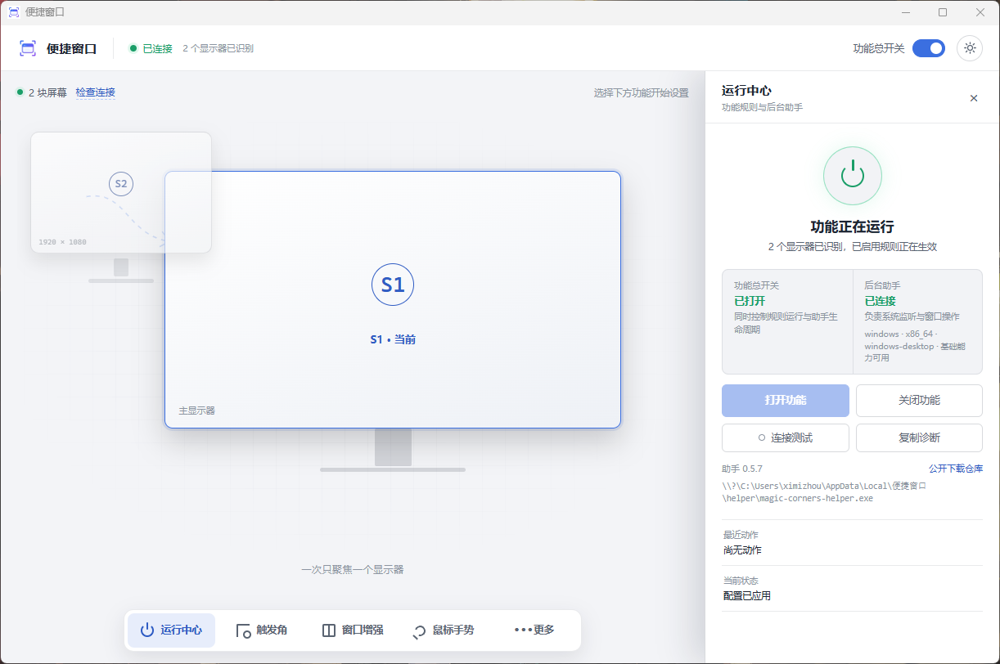
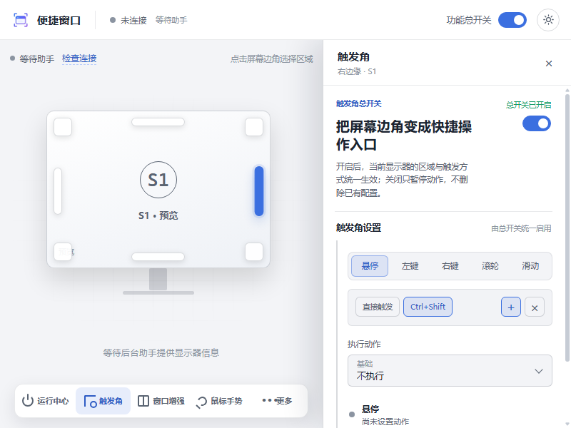
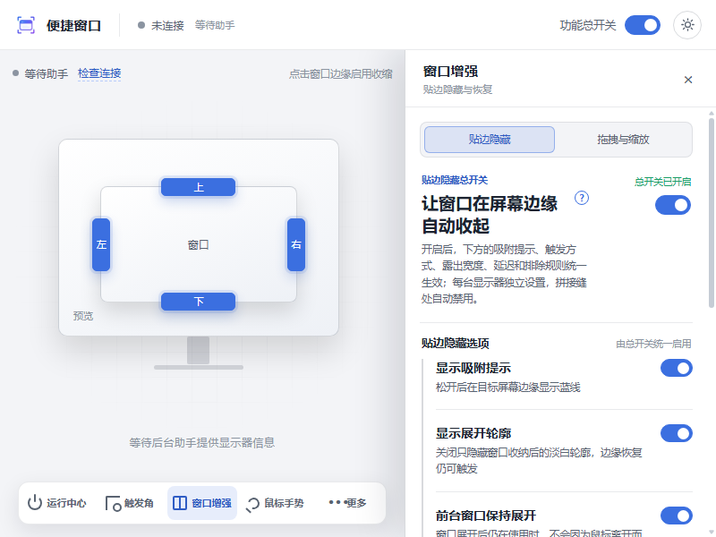
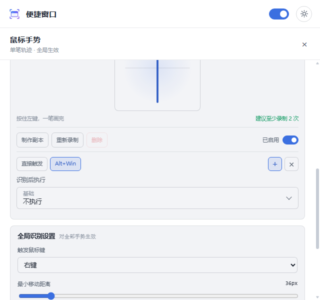
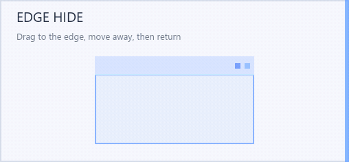

# Convenient Window

[简体中文](README.zh-CN.md) | English

Convenient Window is a desktop utility for hot zones, window control, global mouse gestures, screenshots, and topmost-window control. Version 0.5.8 keeps the complete Windows implementation and adds native platform boundaries for macOS and Linux X11.

Settings are saved and applied as they change. The standalone app runs from the system tray and packages its native Rust helper with the desktop application.

<p align="center">
  
</p>

## Download

Download the Windows installer or portable archive from the [latest stable release](https://github.com/ximizhou/convenient_window_free/releases/latest). The stable release currently contains Windows assets only; macOS and Linux packages are not published until native acceptance is complete.

- **Installer (`setup.exe`)**: recommended for a normal per-user installation.
- **Portable ZIP**: extract and run without installing.
- **System requirement for the published packages**: Windows 11 x64.

Release assets are currently unsigned. Windows may show an unknown-publisher or Microsoft Defender SmartScreen warning. Checksums and an artifact manifest are included with each release so the downloaded files can be verified.

## Features

- **Hot zones**: configure the four corners and four edges of each monitor independently, with hover, mouse-button, wheel, and edge-movement triggers.
- **Window edge hiding**: move windows partly off-screen and restore them from a visible edge strip, with multi-window and multi-monitor support. The pale restore outline can be hidden independently without disabling edge restoration.
- **Anywhere move and resize**: move or resize the active window with configurable modifier-and-mouse combinations.
- **Topmost controls**: keep a window above others and optionally use a small on-window pin to release it quickly.
- **Global mouse gestures**: bind gestures to shortcuts, system actions, commands, and window controls; create and manage custom gesture samples.
- **Screenshots and pinned images**: capture an area, keep the image above other windows, move or resize it, adjust opacity, copy it, or save it as PNG.
- **Local OCR**: recognize text with Windows 11 language capabilities and copy the result without uploading the screenshot.
- **Per-monitor configuration**: preserve independent profiles across supported display layouts and signed virtual-desktop coordinates.
- **Live settings**: most changes are persisted and applied immediately, without a separate save step.
- **Light and dark themes**: follow the system appearance by default or remember a manual selection.

## Screenshots

<table>
  <tr>
    <td width="50%"></td>
    <td width="50%"></td>
  </tr>
  <tr>
    <td align="center"><strong>Hot zones</strong></td>
    <td align="center"><strong>Window enhancement</strong></td>
  </tr>
  <tr>
    <td colspan="2"></td>
  </tr>
  <tr>
    <td colspan="2" align="center"><strong>Mouse gestures, screenshots, and local OCR</strong></td>
  </tr>
</table>

### Edge-Hide Tutorial

The in-app tutorial demonstrates the full cycle: drag a window to the screen edge, move the pointer away to hide it, then return to the visible strip to restore it.

<p align="center">
  
</p>

## Quick Start

1. Download the installer or portable ZIP from the [latest release](https://github.com/ximizhou/convenient_window_free/releases/latest).
2. Install the app, or extract the portable archive and run `ConvenientWindow.exe`.
3. Open Convenient Window from the system tray.
4. Turn on the main feature switch, then configure hot zones, window enhancements, or mouse gestures.

Closing the settings window keeps the tray application running. Use the tray menu to reopen settings, control startup behavior, or quit the application.

## Privacy and Security

- OCR is performed through local Windows APIs. Screenshots are not uploaded for recognition.
- Configuration, authentication tokens, usage data, and logs stay in the application's local data directory.
- Local WebSocket access is protected by a random token.
- A platform-native single-instance lock prevents separate host integrations from controlling competing helper processes.

See [SECURITY.md](SECURITY.md) to report a vulnerability privately.

## Current Limitations

- Windows 11 x64 is the release-accepted platform and retains the complete feature set.
- macOS (x64 and arm64) has a native helper boundary for global input, accessibility window control, monitor discovery, and screen capture. Accessibility and Screen Recording permissions are required. OCR, audio actions, edge hiding, and arbitrary-window topmost are explicitly unavailable.
- Linux x64 under X11 has native helper support for global input, window control, monitor discovery, screen capture, and EWMH topmost. OCR, audio actions, and edge hiding are explicitly unavailable.
- Linux Wayland is detected and reports unavailable capabilities; the helper does not pretend to provide global input or arbitrary-window control there.
- macOS and Linux release assets remain unverified until native runner and real-machine smoke evidence is recorded.
- The installer and executable are not currently code-signed.
- Automatic application updates are not implemented.

## For Developers

This repository is the source of truth for:

- `apps/desktop/`: the Tauri 2 desktop host and reusable Svelte interface.
- `helper/`: the shared Rust helper used by the standalone desktop app and supported host integrations.
- `scripts/`: reproducible build, packaging, smoke-test, and artifact-audit entry points.

Host integrations consume this repository as a submodule and supply their own host adapters. They do not maintain a second copy of the helper source.

### Prerequisites

- Node.js `24.14.0` as pinned by `.node-version`
- Windows 11 x64 for the release installer, portable archive, and full Windows behavior
- macOS 13+ (x64 or arm64) for native helper checks; grant Accessibility and Screen Recording permissions when running the helper interactively
- Ubuntu 22.04+ with an X11 display (CI uses Xvfb) for Linux helper checks; Wayland sessions are detection/degradation tests only
- Rust `1.96.0` or a newer stable toolchain for native macOS/Linux checks. The repository `rust-toolchain` pins the Windows GNU target, so native runners must invoke `cargo +stable` explicitly.

Install dependencies and run the frontend checks:

```powershell
npm ci
npm run desktop:test
npm run desktop:check
npm run desktop:frontend
```

Build the Svelte frontend, Rust helper sidecar, Tauri application, per-user NSIS installer, and portable archive:

```powershell
npm run desktop:build
```

Run the packaged lifecycle and artifact checks:

```powershell
npm run desktop:runtime-smoke
npm run desktop:runtime-conflict-smoke
npm run desktop:runtime-force-kill-smoke
npm run desktop:install-smoke
npm run desktop:audit
npm run desktop:source-audit
```

For helper-only Windows development, run commands from `helper/` so its linker configuration is applied:

```powershell
rustup toolchain install 1.96.0-x86_64-pc-windows-gnullvm --profile minimal --component rustfmt
cd helper
rustup run 1.96.0-x86_64-pc-windows-gnullvm cargo fmt --check
rustup run 1.96.0-x86_64-pc-windows-gnullvm cargo test
```

The Windows build generates `THIRD-PARTY-NOTICES.txt` from the installed npm production tree and locked Cargo dependency graphs. The installer and portable package must contain both that file and the project license; missing or unauditable license text stops the build.

Native macOS checks:

```bash
npm ci --prefix apps/desktop
npm --prefix apps/desktop run check
npm --prefix apps/desktop test
npm --prefix apps/desktop run build
cargo +stable fmt --manifest-path helper/Cargo.toml --check
cargo +stable test --manifest-path helper/Cargo.toml --target x86_64-apple-darwin
cargo +stable check --manifest-path apps/desktop/src-tauri/Cargo.toml --target x86_64-apple-darwin
```

Native Linux X11 checks (the display must be available; CI starts Xvfb):

```bash
sudo apt-get install -y pkg-config libx11-dev libxtst-dev libxi-dev libxinerama-dev libxrandr-dev libxss-dev libwayland-dev libgtk-3-dev libwebkit2gtk-4.1-dev libayatana-appindicator3-dev librsvg2-dev xvfb
Xvfb :99 -screen 0 1920x1080x24 &
export DISPLAY=:99
export XDG_SESSION_TYPE=x11
npm ci --prefix apps/desktop
npm --prefix apps/desktop run check
npm --prefix apps/desktop test
npm --prefix apps/desktop run build
cargo +stable fmt --manifest-path helper/Cargo.toml --check
cargo +stable test --manifest-path helper/Cargo.toml --target x86_64-unknown-linux-gnu
cargo +stable check --manifest-path apps/desktop/src-tauri/Cargo.toml --target x86_64-unknown-linux-gnu
```

More technical information:

- [Architecture](docs/architecture.md)
- [Testing](docs/testing.md)
- [Release process](docs/release.md)
- [Security policy](SECURITY.md)

## Release Integrity

Public builds follow an immutable acceptance process: a clean `main` build is published once, its installer and portable archive are tested, and the same assets are promoted from Pre-release to stable without replacement. Every release includes SHA-256 checksums and an artifact manifest tied to the source commit.

## License

This project is source-available under the [PolyForm Noncommercial License 1.0.0](LICENSE).

You may view, study, modify, and use the software for personal and other noncommercial purposes under the license terms. Commercial use requires a separate written license from the copyright holder.

This license applies to the repository from the commit that introduced it onward. Earlier versions already published under the MIT License remain available under the license granted with those versions.
